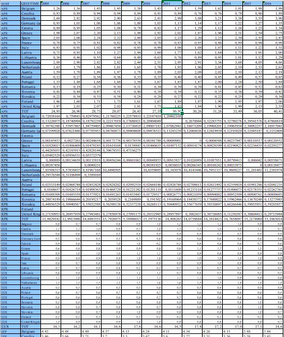
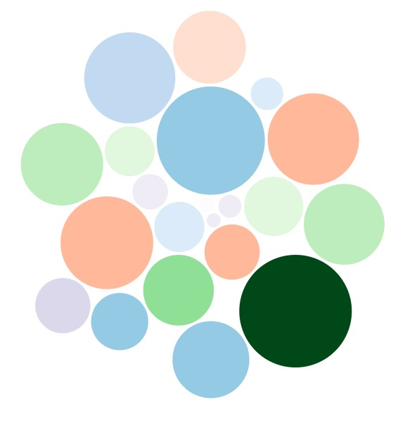
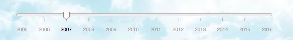
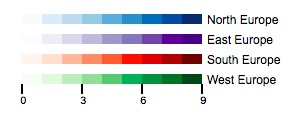
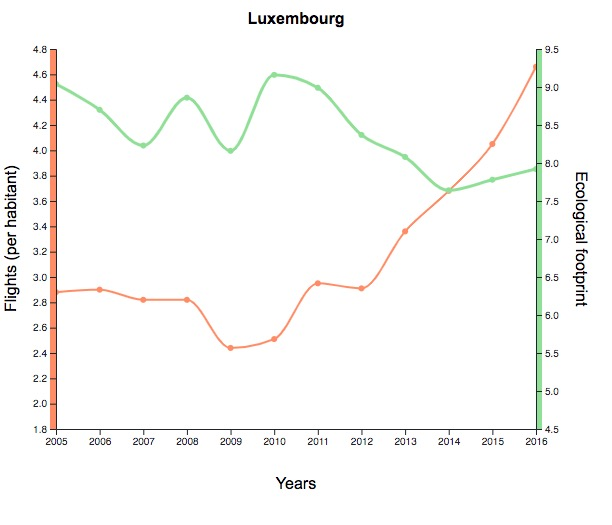
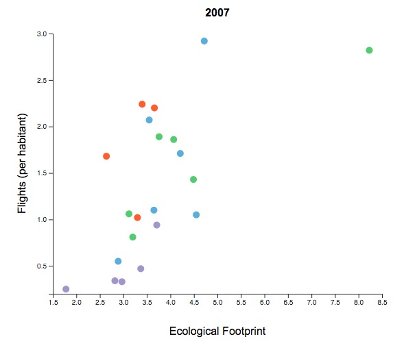
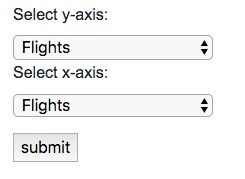
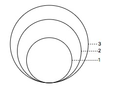
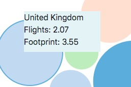

# Process Book

## Voor Week 1
Via United Nations Office on Drugs and Crime kwam ik op een duidelijke dataset over misdaad en drugs. Hierin staat veel wereldwijde data over het aantal misdaden (en verschillende soorten daarvan), vervolgingen en gevangenen per jaar per land in count en in rate (niet per se duidelijk wat deze rate inhoud). Al snel was ik er over uit dat ik wereldwijde misdaad rate interessant vond en dat dit een fijne dataset is die ik wil gebruiken. Ik kies voor het tijdsinterval 2000-2017.

## Week 1
Deadlines:
* Maandag: Proposal
* Dinsdag: Design
* Vrijdag: Prototype

### 3 juni
Met feedback op mijn korte proposal maakte ik een aantal nieuwe beslissingen en aanpassingen voor mijn uiteindelijke proposal.

#### Omvang
Omdat de wereldwijde data incompleet was, besloot ik mij op enkel Europa te focussen.

#### Probleemstelling
'Misdaad in Europa' is niet echt een probleem wat je kan onderzoeken of oplossen. De probleemstelling van het onderzoek wordt daarom gewijzigd naar 'Voornaamste soort misdaad per land'. Hierbij kan de uitkomst helpen met beslissen naar welke politie projecten geld moet gaan om de meeste misdaad te bestrijden.

#### Opbouw figuren
De eerste opbouw (wereldkaart --> double bar chart --> aster plot) moest vervangen worden. In de wereldkaart is namelijk maar 1 dimensie verwerkt en dat is niet genoeg om het onderwerp van dit project aan het licht te laten komen. Er is gekozen om de focus te leggen op de verhouding tussen Violent en Non-violent misdaad. De eerste figuur is dan ook een Sunburst (Land --> violent/non violent). De tweede figuur is gekozen voor een line chart die het verloop over tijd laat zien. De derde figuur is een bar chart die de getallen per subcategorie laat zien. Hiervoor wilde ik eerst een piechart gebruiken, maar deze leek te veel op een suburst. Daarnaast laat een bar chart goed onderscheid in categorien zien.

#### Data
De data moet per misdaad subcategorie rate verzameld worden en samen worden gevoegd in 1 file voor ieder land. Ik weet nog niet zeker of dat goed gaat lukken en wat de verhoudingen tussen de rates zijn. Misschien valt het violent wel in het niet tegenover non violent of andersom. Dat gaan we woensdag zien...

### 4 juni
Vandaag was het eerste mentorgesprek en maak ik de laatste beslissingen over mijn design.

#### Probleemstelling
Ik zette wat vraagtekens bij mijn probleemstelling: is het wel duidelijk genoeg? Ik probeerde meer mogelijkheden te vinden met mijn dataset. Misschien drugsgebruik linken aan misdaad, maar de data over drugsgebruik was (logisch genoeg) erg incompleet. Ik hield het er maar bij wat andere ideeen sloten niet aan bij een juiste 'probleemstelling'.

#### Opbouw figuren
De opbouw Sunburst -> line chart -> bar chart blijft. De Sunburst krijgt een extra dimensie, namelijk noord/oost/zuid/west Europa met een kleur.

#### Knoppen
Er wordt erop gewezen dat je ook knoppen moet toevoegen, dit was ik vergeten. Ik voeg bij de eerste suburst een slide toe voor het jaartal (2000 tot 2017). Daarnaast voeg ik bij de line chart een checkbox toe die violent, non violent, of allebei de lijnen laat zien.

Het design en diagram werd in elkaar gezet dmv screenshots en pijlen.

### 5 juni
Vandaag was de eerste stand up. Daarnaast begin ik aan mijn prototype.

#### Checkbox en links
Ik kreeg van mijn groepje feedback dat ik misschien in de donutchart (ingezoomde versie van sunburst) de vakken 'violent' en 'non violent' kon linken aan de line chart en de tijdslide weg kon laten. De tijd dimensie is alleen zichtbaar in de line chart De 3 nieuwe opties van de line chart worden dan: Violent(per categorie), Non Violent (per categorie) en beide totaal. Ik laat dit als optie omdat het veel werk kan zijn.

#### Pagina
Het basis ontwerp voor de homepage werd gemaakt om te kijken wat de meest praktische manier is om het in te delen.

#### Data
Ik heb van Europa de een categorie violent (homicide rate) en non violent (theft rate) in 1 tabel gezet. Het was erg lastig omdat de landen en jaren niet compleet overeen kwamen van de verschillende data sets dus het kostte veel tijd. Dit om uit te proberen of het uberhaubt mogelijk is, en het daarna uit te breiden met meer categorien van violent en non violent. Het begin van de sunburst werd gemaakt maar gaf nog geen goed beeld, ik zou er morgen aan verder werken.

### 6 juni
Verder werken aan de data en proberen deze vandaag op orde te krijgen.

#### Data
De gehele dag ben ik bezig geweest om alle data per categorie in de juiste format van jaren en landen te krijgen. Echter, op de helft bleek de data van de United ations Office on Drugs and Crime niet te kloppen. de data versprong verdacht raar, het leek of ze af en toe een 0 vergeten waren. Uit frustratie  probeerde ik andere data te zoeken over dit onderwerp maar helaas was er niet veel te vinden.

### 7 juni
Er leek niets anders op te zitten dan een nieuw onderwerp te bedenken, dus daar ben ik mee aan de slag gegaan. Dit keer zal ik eerst een complete dataset proberen te vinden, en daar een onderzoeksvraag bij vormen. Daarna wil ik doormiddel van andere datasets dit vraagstuk proberen te beantwoorden.

#### Onderwerp
Het onderwerp wordt het vliegverkeer binnen Europa per land per jaar (2005-2017, deze data is het meest compleet). De bron van alle datasets is . Het onderwerp trekt me aan en interesseert me, omdat ik altijd benieuwd ben hoe mensen op klimaatverandering reageren of hun eigen gedrag er naar aanpassen. De focus ligt op binnen Europa omdat het alternatief een trein kan zijn. De probleemstelling is dan ook: welke landen maken gemiddeld de meeste vluchten binnen Europa per inwoner?

#### Data
De datasets worden verzameld en al in een excel bestand gezet om te kijken of ze kloppen en compleet zijn. Als eerste is dit het aantal vluchten per inwoner. Andere datasets die bij dit onderwerp betrokken zijn, zijn het aantal internationale treinritten per inwoner en de uitgaven van de overheid aan verbetering van milieu. De correlatie tussen deze onderwerpen kan erg interessant zijn. Om het aantal treinritten en vluchten per inwoner te berekenen, wordt de data van het aantal passagiers van internationale vluchten en treinritten binnen Europa per land gedeeld door de populatie van dat land. Door deze zelfgevormde dataset krijg ik een beter idee bij de rate per land.

## Week 2
Vormgeving van het nieuwe onderwerp.

### 10 juni
Vandaag verder gewerkt aan het nieuwe onderwerp: European Air Transport. Ik probeer een beter beeld te krijgen welke figuren ik ga gebruiken en hoe ik het qua data ga aanpakken.

#### Visualisaties
Er zijn 2 ideeen voor visualtisaties.

* De eerste is een wereldkaart. De kleur per land geeft het gemiddeld aantal luchten per inwoner aan. Het jaar kan je kiezen met een slider (2005-2017). Wanneer je op een land klikt, verschijnt er een line chart en een scatter plot. de line chart vormt op de x-as de jaren en de y-as het aantal vluchten. Bij de scatter staat op de y-as het aantal vluchten en de x-as kan je selecteren met een checkbox (overheidsuitgaven, treinritten etc.)

* De tweede is een bubble chart. Ieder land is een bubbel, de grootte geeft het aantal vluchten aan en de kleur de overheidsuitgaven per land. Wanneer je op een land klikt, verschijnt er een line chart en een scatter plot. de line chart vormt op de x-as de jaren en de y-as het aantal vluchten. Bij de scatter staat op de y-as het aantal vluchten en de x-as kan je selecteren met een checkbox (overheidsuitgaven, treinritten etc.)

#### Data
Er moeten een aantal landen komen te vervallen omdat deze te incompleet zijn, bijvoorbeeld Croatie. Verder is de dataset van 2005 tot 2017 redelijk compleet en oogt bruikbaar.

### 11 juni
Op sciencepark meer feedback en ideeën gekregen over mijn nieuwe idee. Deze werk ik uit en ik begin aan de eerste visualisatie.

#### Figuren
Mijn groepje zei in de feedback dat de bubble chart het beste idee was, en dan de ecological footprint mee te nemen. Andere feedback die ik kreeg was een dubbele checkbox voor de scatterplot, zowel op de x als de y as dus. Hiermee kan je zelf kiezen wat je wil laten correleren. Hierdoor ziet mijn visualisatie er als volgt uit:
* Bubble chart
(klik op land --> linechart verspringt en scatter punt licht op)
grootte: gemiddeld aantal vluchten per inw
kleur: footprint
* Line chart
x-as: jaren 2005-2017
y-as: lijn 1 vluchten, lijn 2 footprint
* Scatter plot
(klik op land dus punt --> linechart verspringt en bubble licht op)
x-as: selecteer uit: uitgaven overheid aan milieu, internationale treinritten, internationale vluchten, footprint
y-as: selecteer uit: uitgaven overheid aan milieu, internationale treinritten, internationale vluchten, footprint

#### Data
De data voor de ecologische footprint is van .

#### Visualisatie
voor 2005 wordt er een begin gemaakt aan de bubble chart ter uitprobeersel.

### 12 juni
Vandaag vooral gewerkt aan het samenstellen van alle data en het maken van een voorbeeld html pagina.

#### Data
De data is eerst per categorie voor alle landen verzameld via ec Europe en de Global Footprint Network. De landen vormen hierbij de rijen en de jaren vormen de kolommen. De landen die veel data ontbraken heb ik eruit gehaald. Dit waren Bulgarije, Ierland, Malta, Kroatie, Hongarije en Zweden. Ook is de selectie van jaren beperkt gehouden om de data zo compleet mogelijk te laten. de jaren 2005 tot 2016 blijven hierbij over. In Excel worden de datasets van alle categorien onder elkaar geplaast. De dataset is ready!

#### HTML
Via bootstrap ben ik op ideeën gebracht voor de pagina waarop mijn visualisaties zichtbaar worden. Het bestaat uit een hoofdpagina waar ik het onderwerp zal toelichten, en een link daarop naar de Data pagina waar mijn figuren zullen staan. Daarvoor maak ik via kolommen vast een basis inrichting.

### 13 juni
Ik ben voornamelijk verder gegaan met de bubble chart.

#### Figuren
Als feedback kreeg ik om eerst de bubble chart in een voorbeeld HTML te maken, en pas aan het einde in de uiteindelijke HTML pagina's toe te voegen waaraan ik gister gewerkt heb. Dit zodat ik makkelijker aanpassingen kon maken.

#### Bubble chart
Ik ga verder met de bubble chart waaraan ik 11 juni was begonnen. Hierbij wordt de ecologische footprint vergeleken met het aantal vluchten per inwoner per jaar. Dit lukt wel aardig.

### 14 juni
Vandaag lag de focus nog steeds op de bubblechart.

#### Bubble chart
Deze is nu compleet gemaakt met de juiste grootte voor de waarden. Ook zijn de kleuren op schaal gemaakt (van licht naar donker) en zit er verschil in kleur per deel van europa (noord, oost, zuid, west). Dit is slechts alleen nog voor het jaar 2005 gelukt.

## Week 3
Uitwerken van alle figuren.

### 17 juni
Na het weekend werd het tijd om de volledige dataset in te laden, in plaats van alleen het jaar 2005.

#### Data
Het was even nadenken hoe de data het best ingeladen kon worden. Via een json, dat was al snel duidelijk. Maar welke structuur dan precies? Uiteindelijk heb ik besloten de data als volgt in te richten: {"2005" : [{land1}, {land2} ...], ... , "2016" : [{land1}, {land2} ...]}. Hiervoor heb ik in python een converter geschreven. in land 1 staat de volgende informatie:
* Country
* APR (aantal vluchten naar het buitenland binnen Europa per inwoner dat jaar)
* RPR (aantal treinritten naar het buitenland binnen Europa per inwoner dat jaar)
* EFP (ecologische voetafdruk dat jaar)
* EEX (overheidsuitgaven aan het milieu dat jaar)

### 18 juni
Tijd om de timeslider in elkaar te zetten!

#### Slider
Dit is gelukt via tutorials op het internet. De transition is nog niet helemaal naar wens. Maar dit bewaar ik voor de volgende week.

#### Legenda
Verder heb ik vandaag de kleuren legenda in elkaar gezet met mooie overloop. Precieze cijfers moeten alleen nog worden toegevoegd.

### 19 juni
Vandaag wordt het tweede figuur toegevoegd, de line chart. Volgens tutorials op het internet was het niet een ingewikkeld figuur om in elkaar te zetten en te linken.

#### Line chart
Op de x as staat het tijdsverloop in jaren en er is een dubbele y as, want er worden twee data verlopen weergegeven. De linker as is de APR en de rechter as is de ecologische footprint. Ze krijgen ook beiden een andere kleur.

#### Linked
Wanneer je op de bubble van een land klikt (in welk jaartal dan ook) laat de linechart de tijdsverloop van dat jaar zien.

### 20 juni
Het laatste figuur, de scatterplot, wordt toegevoegd. Deze is niet nieuw voor me en ik kan de afmetingen van de linechart gebruiken wat erg scheelt. De checkbox wordt wel een uitdaging.

#### Scatter plot
De eerste punten waren snel gezet, maar er moeten veel variabelen gewijzigd kunnen worden, namelijk de x as, de y as en het jaartal. Via internet vond ik al snel een checkbox die ik in mijn html zette. Sommige data was incompleet bij de train rides, dat is wel erg storend. Door middel van een for loop worden de incomplete datapoints eruit verwijderd. Ook moet de titel telkens worden aangepast bij nieuwe updates.

### 21 juni
Vandaag heb ik alle figuren uit de voorbeeld html gehaald en in de echte html gezet.

#### Data HTML
Deze indeling was net iets anders dan gewend, hoe ging ik het neerzetten? Het meest struggelde ik met de checkbox. Deze verdween zo uit het zicht als hij onder de scatterplot kwam, dat ik hem maar in de container van de bubble chart heb gezet, rechts onderin. de rest van de indeling sprak erg voor zich, alleen de marges moesten erg gewijzigd worden en het plaatsen van de titels was lastig.

## Week 4
Deadlines:
* Woensdag: Code, License, Read me, Style guide, Process book
* Donderdag: Filmpje, Report
* Vrijdag: Presentaties

### 24 juni
De basis staat er, maar de transitions en tooltips moeten nog netjes worden toegevoegd.

#### Transitions
Tot nu toe werd bij het updaten telkens remove gebruikt, maar nu ga ik die omzetten naar nette en soepele transities.Te beginnen met de bubbel transition, zodat je de bubbels in hun verandering kunt volgen. De opzet van de code ging prima, maar uiteindelijk heb ik lang gezeten om de cx en cy uit de simulatie goed te krijgen. Dit was die dag niet gelukt, ondanks alle hulp. Ik twijfelde telkens erg om 2 verschillende functies te maken (bubble en bubble update bijvoorbeeld) of door middel van een dummy variabele te updaten. Ik koos voor het laatste, om niet opnieuw te hoeven verwijzen. Omdat de bubble transition niet werkte ben ik maar begonnen met de lijn transition.

#### Tooltip
Deze is eindelijk gelukt, nadat hij een tijdje achter het svg verscholen zat. Alleen de waarden moeten nog worden toegevoegd. Het lukt me niet om dit met een regel ertussen te krijgen helaas, dus laat ik het voor nu op alleen de naam van het land.

### 25 juni
Vandaag worden de transitions afgemaakt en de titels en legenda's goed gemaakt.

#### Transitions
Deze bleken niet goed gegaan omdat de variabelen niet in beide if statements gedefinieerd waren. De code is ietswat chaotisch door de overlap of missende overlap. Door een frisse blik was de fout gelukkig goed gevonden. De andere transitions van de line chart en scatter plot zijn wel gemaakt door middel van een aparte update functie, om de vorige fout te voorkomen en deze waren vrij snel gelukt. De bubble update liet ik voor wat het is.
Later kwam ik erachter dat elke eerste keer als een jaar op de slider geselecteerd werd, dat de bubbles van linksboven komen inspringen in plaats van 'verspringen'. Dat kregen we niet te voorkomen. Na overleg met Jasper heb ik besloten om voor de bubble chart zichtbaar te maken, alle jaren een keer aan te roepen zodat je dat niet ziet.

#### Titels en Legenda's
De Site en visualisatie wordt duidelijk gemaakt door goede titels en legenda's. Om niet telkens 'buitenlandse vluchten binnen Europa' te hoeven noemen, worden de variabelen omschreven op de home page en minder lang genoemd op de data page.

### 26 juni
Dag van de deadline, site netjes maken dus, en stylesheet en process book in orde brengen.

#### Tooltip
Door feedback van mijn groepje kwam ik erachter hoe ik het beste de tooltip toe kon voegen, namelijk door foreign object en html.

#### HTML
Op de home html komt een uitleg en afbeeldingen van de vraagstelling van het project, de data en variabelen. Daarnaast is een link naar de visualisatie, anders is er te veel informatie voor op een enkele pagina.

#### Code
De code wordt snel netjes gemaakt volgens de style sheets en de files worden in verschillende mapjes gestopt waardoor de paden anders moeten.
